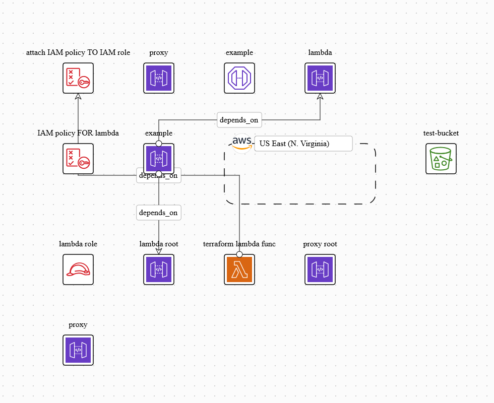

# lambda-with-api-gateway

This project contains source code and supporting files for a serverless application that you can deploy with the SAM CLI. It includes the following files and folders.

- HelloWorldFunction/src/main - Code for the application's Lambda function.
- events - Invocation events that you can use to invoke the function.
- HelloWorldFunction/src/test - Unit tests for the application code. 

The application uses several AWS resources, including Lambda functions and an API Gateway API. These resources are defined in the `template.yaml` file in this project. You can update the template to add AWS resources through the same deployment process that updates your application code.

This document was created to guide the use of AWS LocalStack. [LocalStack](https://localstack.cloud/) is a tool that emulates the execution of various AWS services locally.

There are two ways to set up your application with AWS LocalStack:

1. Compiling and creating resources manually through the command line interface (CLI) and localstack.

   More details [Running_With_LocalStack_Manual](Running_With_LocalStack_Manual.md)

2. Using the Terraform tool to automate resource creation (recommended option).

   More details [Running_With_LocalStack_Terraform](Running_With_LocalStack_Terraform.md)

Topology:
[image](diagram-basic-cases-lambda.png)

